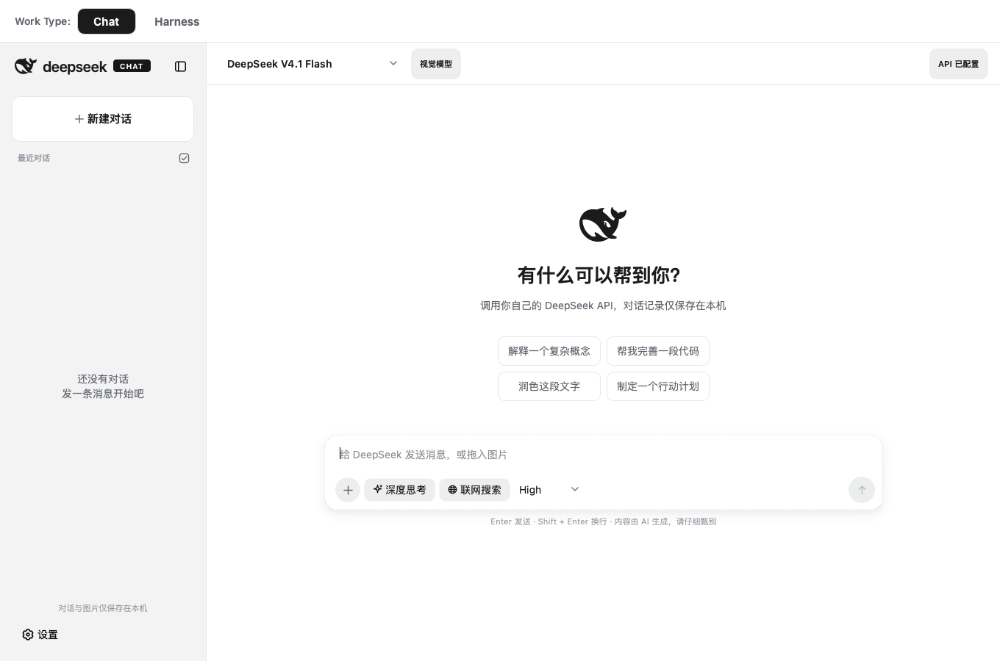
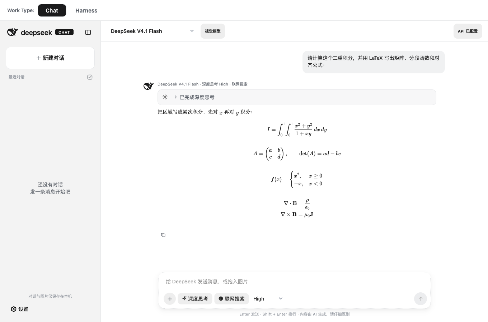
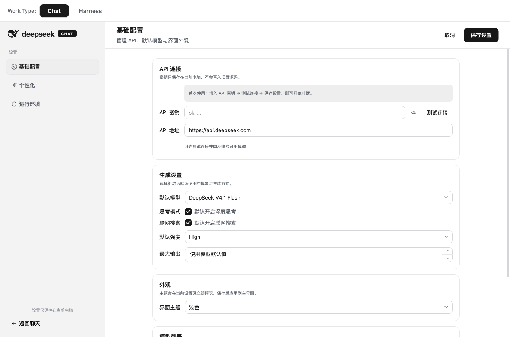
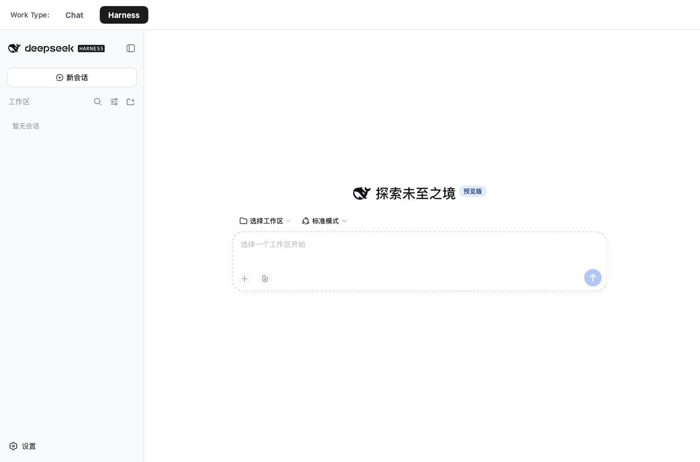

# DeepSeek 本地桌面客户端

一个面向 macOS 的 DeepSeek API 桌面客户端。它把 Chat、深度思考、联网搜索、图片输入、Markdown/LaTeX、本地历史和官方 Harness 集成到同一个窗口中，界面轻量，数据保存在本机，工作模式可以从顶部一键切换。

当前发布版本：`v1.0.0` · macOS Apple Silicon

## 最新版本与下载

> **[前往 GitHub Releases 查看最新版本、更新日志和下载链接 →](https://github.com/quzhenghao/deepseek-chat-gui/releases)**
>
> 请从 Release 页面选择最新版本和对应平台的安装包。README 不固定指向某个旧版本文件，后续更新会持续以 Release 页面为准。

## ⚠️ 首次打开安全提示

本项目目前没有 Apple Developer ID 签名和 notarization。安装完成后第一次打开时，macOS 可能显示“无法验证开发者”或“Apple 无法检查‘DeepSeek’是否包含恶意软件”，并暂时阻止应用运行。

请先在 Finder 中尝试打开一次应用，然后进入 **系统设置 → 隐私与安全性**，向下滚动到“安全性”区域，点击 **“仍要打开”**，按系统提示确认后即可正常运行。请先确认安装包来自本项目的 [GitHub Releases](https://github.com/quzhenghao/deepseek-chat-gui/releases)。

## 界面预览

### Chat 欢迎页



侧栏管理本地对话，顶部 `Work Type` 在 Chat 与 Harness 之间切换，输入框会根据当前是否有消息自动切换为居中布局或底部停靠布局。

### 复杂数学回答与本地 LaTeX 渲染



公式使用应用内置的 KaTeX 在本机渲染。截图中的二重积分、矩阵、分段函数和多行公式都来自消息文本，没有经过截图或在线服务转换；选中消息后可以复制，右键会保留选区并打开现有编辑菜单。

### 设置与模型同步



设置页提供 API 连接测试、模型列表、深度思考强度、联网搜索默认开关、主题、系统提示词和 Harness 运行环境管理。

### 切换到 Harness



点击顶部 `Work Type` 的 `Harness` 即可进入官方 Harness Web UI。Chat 与 Harness 共用同一个窗口和运行环境，切换后可以直接选择工作区、创建会话并使用 Harness 的项目、工具和审批能力。

## 为什么使用本地客户端

- **直接接入 API，模型选择不被网页版入口限制**：本地端使用自己的 DeepSeek API Key。点击“测试连接”后，客户端会读取 API 的 `/models` 返回值，把当前账号有权限的模型同步到设置页，因此可以在同一个客户端切换多个有权限的付费模型，也可以填写自定义网关和模型 ID。实际可用模型仍由 API 账号权限和服务端返回结果决定。
- **回答内容在本机排版**：Markdown、代码块、表格、引用和数学公式由本地渲染器处理；KaTeX、样式和数学字体随应用打包，不依赖在线 CDN。
- **Chat 与 Harness 集成在一个窗口**：顶部 `Work Type` 选择器可以在原生 Chat 和官方 Harness Web UI 之间切换。两种工作流共用应用设置、品牌和运行环境，不需要来回打开不同应用。
- **对话和媒体留在本机**：历史记录、发送过的图片、主题和提示词保存在用户数据目录；应用不会把本地历史同步到额外的第三方服务。
- **适合长回答**：流式回答默认跟随底部，手动向上阅读后会暂停跟随；点击“回到最新消息”即可恢复。长公式只在公式区域横向滚动，不会撑宽整个消息列。
- **安装包自带 Harness 运行时**：macOS DMG 内置 Node.js 与固定版本的 Harness CLI，正常使用 Harness 不要求额外安装 Node.js、npm 或 npx。

## 功能

### Chat

- DeepSeek API 流式输出和深度思考
- `low`、`high`、`max` 三档思考强度
- 联网搜索按钮与“默认开启联网搜索”设置，通过 DeepSeek Responses API 的 `web_search` 工具接入
- 视觉模型图片输入：选择、拖入或粘贴图片
- Markdown、代码块、复制按钮、表格、引用、链接和离线 KaTeX
- 用户与 AI 消息均可用文本光标选中
- 左键点击其他区域取消选区；右键不清除选区并打开复制、全选等菜单
- 本地会话创建、自动标题、重命名、批量删除和媒体清理
- 浅色/深色主题与自定义系统提示词

### Harness

- 官方 `@deepseek-ai/dsh` Web UI 嵌入 Qt WebEngine
- 项目、工具、审批、文件和轨迹等能力交给官方 Harness 页面处理
- Chat 启动后可以后台静默预热 Harness，首次切换更快
- 设置页可以配置多个项目目录、重新检测运行环境、打开配置目录和查看官方入口
- Harness 只监听本机 loopback；API Key 通过进程环境传递，不写进 Harness 配置文件

### 本地运行时

- 当前 Harness 运行包固定为 `@deepseek-ai/dsh@0.1.5-rc.1`
- 构建脚本固定下载 Node.js `22.19.0` 并将运行时收进 `.app`
- 打包后优先使用应用内置运行时；源码运行时可回退到系统 `npx`
- 应用退出时清理 Harness 子进程和临时探测资源

## 安装

1. 前往 [GitHub Releases](https://github.com/quzhenghao/deepseek-chat-gui/releases)，打开最新版本页面并下载对应的 macOS DMG。
2. 打开 DMG，把应用拖到“应用程序”。
3. 首次启动进入设置页，填写 API Key，点击“测试连接”，确认模型同步成功后保存设置。
4. 返回 Chat，选择模型和思考强度即可开始使用；顶部 `Work Type` 可以切换到 Harness。

当前 DMG 是 Apple Silicon 构建，适用于 arm64 Mac。首次打开遇到安全提示时，请按上方步骤在“隐私与安全性”中允许应用；相关背景可参考 [Apple 官方说明](https://support.apple.com/zh-cn/102445)。

## 从源码运行

需要 macOS、Python 3.11+、Qt WebEngine 和一个可用的 DeepSeek API Key。项目不要求全局安装依赖，建议使用已有的 Conda 环境：

```bash
conda activate deepseek-chat
python -m pip install -r requirements.txt
python main.py
```

首次启动会自动进入设置页。默认 API 地址为 `https://api.deepseek.com`；使用兼容网关时可以替换地址，并手动填写网关返回的模型 ID。

## 本地数据

默认目录为 `~/.deepseek_chat_gui/`：

```text
~/.deepseek_chat_gui/
├── config.json          API、模型、主题和个性化设置
├── conversations.json   对话和消息记录
├── media/               已发送图片的本地副本
├── logs/                崩溃与未捕获异常日志
└── harness/             Harness 设置、缓存和浏览器数据
```

API Key 以本机配置形式保存，便于下次启动自动加载；不要把该目录提交到版本库或在共享电脑中保存正式密钥。可以用 `DEEPSEEK_CHAT_GUI_HOME` 指向独立目录进行测试：

```bash
DEEPSEEK_CHAT_GUI_HOME=/tmp/deepseek-chat-test python main.py
```

删除对话时，消息记录和该对话的本地图片会一起删除。保存 JSON 使用临时文件原子替换，降低异常退出造成历史损坏的概率。

## 测试

自动化测试不访问真实 API：

```bash
conda activate deepseek-chat
QT_QPA_PLATFORM=offscreen python -m unittest discover -s tests -v
```

覆盖请求参数、流式响应、图片消息、模型同步与迁移、Markdown/LaTeX 边界、代码复制、公式溢出、对话存储、思考折叠、Chat/Harness 模式切换、设置页和本地运行时状态。

## 打包 macOS DMG

```bash
conda activate deepseek-chat
python -m pip install -r requirements-dev.txt
./scripts/package_macos.sh
```

脚本会先准备本地 Harness 运行时，再由 PyInstaller 生成 `dist/DeepSeek.app`，最后使用系统 `hdiutil` 生成：

```text
release/DeepSeek-<版本>-macos-<架构>.dmg
```

`vendor/harness/`、`build/`、`dist/`、`release/` 和 `.dmg` 已加入 `.gitignore`，不会进入源码提交；DMG 成品通过 GitHub Release 分发。

构建时如只需调试原生 Chat，可以设置 `DEEPSEEK_SKIP_HARNESS_BUNDLE=1` 跳过运行时供应；这种包在没有系统 Node.js 时无法启动 Harness。

## 发布

版本号位于 `app/__init__.py`。保持版本号为 `1.0.0` 时，完整流程为：

```bash
./scripts/package_macos.sh
git add .
git commit -m "Release DeepSeek 1.0.0"
git push origin main
./scripts/release_github.sh
```

`scripts/release_github.sh` 会读取 `update.md` 作为 Release 说明，并上传对应架构的 DMG。覆盖已有 `v1.0.0` 时，需要先确认远端标签和 Release 资产，再按发布脚本执行覆盖操作。

## 兼容性与已知提示

- 当前正式成品为 macOS Apple Silicon；Intel 或 universal 版本需要在对应构建目标上重新打包验证。
- 当前安装包没有 Apple 公证，首次打开可能需要在“隐私与安全性”中允许。
- 终端偶发的 `error messaging the mach port for IMKCFRunLoopWakeUpReliable` 是 macOS 输入法框架的系统级警告，不是客户端异常退出的证据；应用保留原生输入法以确保中文输入可用。
- 若应用真的退出，优先查看 `~/.deepseek_chat_gui/logs/crash.log`、`errors.log`，以及 macOS 的 `~/Library/Logs/DiagnosticReports/`。
- Harness 是官方开发者预览运行时；涉及项目文件、命令执行和审批操作时，请按 Harness 页面提示确认风险。

## 项目结构

```text
deepseek-chat-gui/
├── main.py
├── app/
│   ├── api.py              API 请求、模型同步和消息载荷
│   ├── config.py           配置、模型能力和迁移
│   ├── harness.py          Harness 进程、端口和运行时管理
│   ├── markdown.py         Markdown 与 KaTeX HTML
│   ├── storage.py          对话和媒体存储
│   └── ui/                 Chat、Harness、设置页和主题
├── assets/
│   ├── vendor/katex/       随应用打包的 KaTeX 资源
│   └── screenshots/        README 界面截图
├── scripts/                Harness 供应、DMG 构建和 GitHub 发布
├── tests/                  API、渲染、配置、存储和 UI 回归测试
├── DeepSeekChat.spec       PyInstaller 配置
├── update.md               v1.0.0 发布说明
└── requirements*.txt       运行与开发依赖
```
